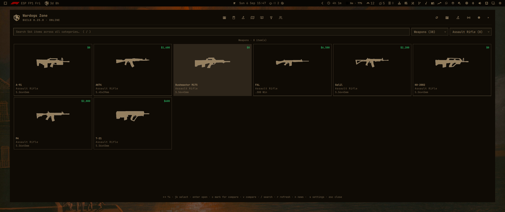
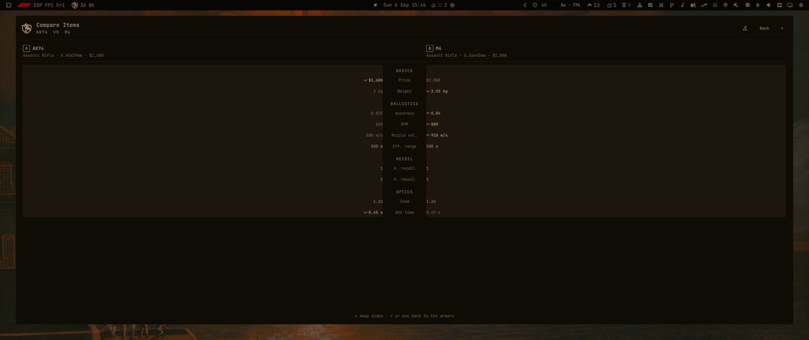
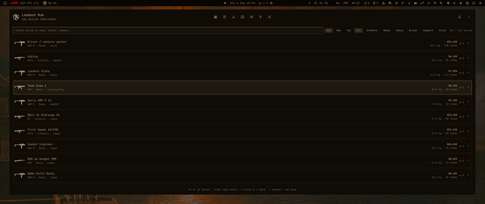
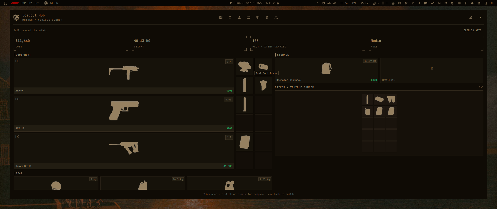
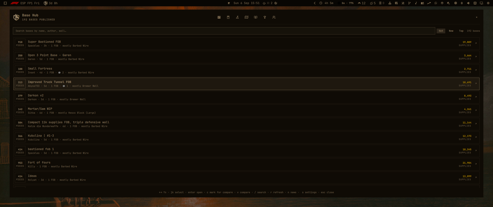
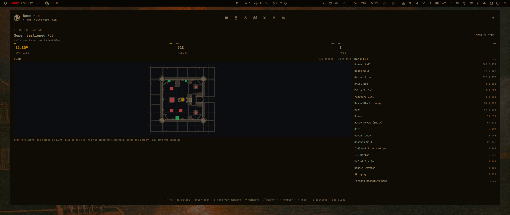

# Wardogs Zone

A [wardogs.zone](https://wardogs.zone) armory/item browser and news feed for the Omarchy bar.



## Features

- Bar pill with live WARDOGS build version and online status
- Armory browser — 565+ items with per-caliber filter and name search
- Compare — diff two items side by side
- Loadout hub — published build list with equipment sheets
- Base hub — published FOB plans with sort/search and plan sheets
- News feed — latest Wardogs Zone articles
- Notifications for new build versions and new articles

## Screenshots

| Armory browser | Compare |
| --- | --- |
|  |  |

| Loadout hub | Build sheet |
| --- | --- |
|  |  |

| Base hub | Base sheet |
| --- | --- |
|  |  |

## Install

```sh
omarchy plugin add https://github.com/niziul/niziul.wardogs.plugin.git --enable
```

Then add the "Wardogs Zone" widget to your bar.

## Usage

- **Left click** — toggle the panel
- **Right click** — open settings
- **Middle click** — open wardogs.zone in the browser

### IPC (command line)

Every panel can be driven directly with `omarchy-shell niziul.wardogs.<target> <method> [args]`:

| Target | Method | Action |
|--------|--------|--------|
| `niziul.wardogs.window` | `toggle`, `open` | Toggle / open the overlay window |
| `niziul.wardogs.armory` | `open` | Open the panel to the armory |
| `niziul.wardogs.news` | `open` | Open the news feed |
| `niziul.wardogs.compare` | `mark` | Mark the armory item under the cursor |
| | `open` | Open the compare view |
| | `swap` | Swap the two compared items |
| | `clear` | Clear both compare slots |
| `niziul.wardogs.settings` | `open` | Open the settings panel |
| | `save` | Open the settings panel and save |
| | `setRefreshInterval <sec>` | Set the refresh interval (60–86400) and save |
| `niziul.wardogs.hub` | `open` | Open the loadout hub |
| | `openBuild <id>` | Open a published build's sheet |
| | `back` | Back to the build list |
| `niziul.wardogs.base` | `open` | Open the base hub |
| | `sort <hot\|new\|top>` | Set the base plan sort |
| | `search <text>` | Search base plans |
| | `openBase <id>` | Open an FOB plan |
| | `back` | Back to the plan list |

Examples:

```sh
omarchy-shell niziul.wardogs.base sort hot
omarchy-shell niziul.wardogs.window toggle
omarchy-shell niziul.wardogs.hub openBuild <id>
```

### Keyboard shortcuts

| Key | When | Action |
|-----|------|--------|
| `j` / `k` (`h` / `l`, arrows) | Armory, hub, base | Move selection |
| `enter` (or `space`) | Armory, hub, base, settings | Activate the selected item / field |
| `/` | Armory, hub, base list | Focus the search bar |
| `c` | Armory, hub | Mark the selected item for compare |
| `v` | Armory, hub, compare | Open the compare view |
| `x` | Compare | Swap the two compared items |
| `s` | Any | Open settings (and save there) |
| `n` | Any | Open the news feed |
| `b` | Any | Open the loadout hub |
| `r` | Any | Refresh data from wardogs.zone |
| `esc` | Any | Step back / close the panel |

## Configuration

All settings are accessible from the settings panel (right-click the pill or press `s`). They persist per-widget instance with the shell.

| Setting | Default | Description |
|---------|---------|-------------|
| Refresh interval | 300s | How often to refresh wardogs.zone data (60–86400) |
| Always show icon | on | Keep the pill visible even when offline |
| Default category | weapon | Armory category to open (weapon, ammo, attachment, armor, vehicle, medical, ...; empty = all) |
| Name/caliber filter | *(empty)* | Default armory search filter (empty = none) |
| Notify on new version | on | Desktop notification when the WARDOGS build version changes |
| Notify on new news | on | Desktop notification when Wardogs Zone publishes a new article |

## Requirements

- Omarchy (Quickshell) with a bar surface
- Network access to wardogs.zone
- Python 3 (for the version/news persistence script)

## Uninstall

Remove the plugin from the shell:

```sh
omarchy plugin remove niziul.wardogs
```

This removes the plugin code but leaves its cache behind. Clean that up too:

```sh
rm -rf ~/.cache/wardogs-plugin
```

`~/.cache/wardogs-plugin/` holds only cached wardogs.zone data (armory index, hub, plan details and icons) and the seen/notification state. No user data is stored there.

If a bar widget entry lingers after removal, rescan:

```sh
omarchy-shell shell rescanPlugins
```

## Development

The plugin deploys straight from this repository; changes are picked up with

```sh
omarchy restart shell
```

Parser unit tests (plain Node, no framework) run from the repo root:

```sh
node tests/hub.test.js
node tests/compare.test.js
node tests/details.test.js
node tests/model.test.js
node tests/baseList.test.js
```

## License

MIT
